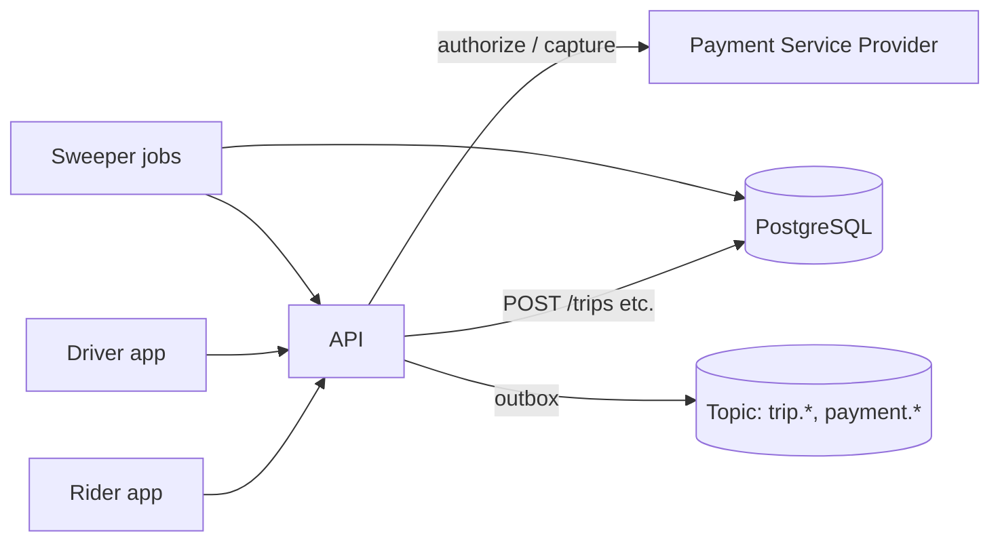
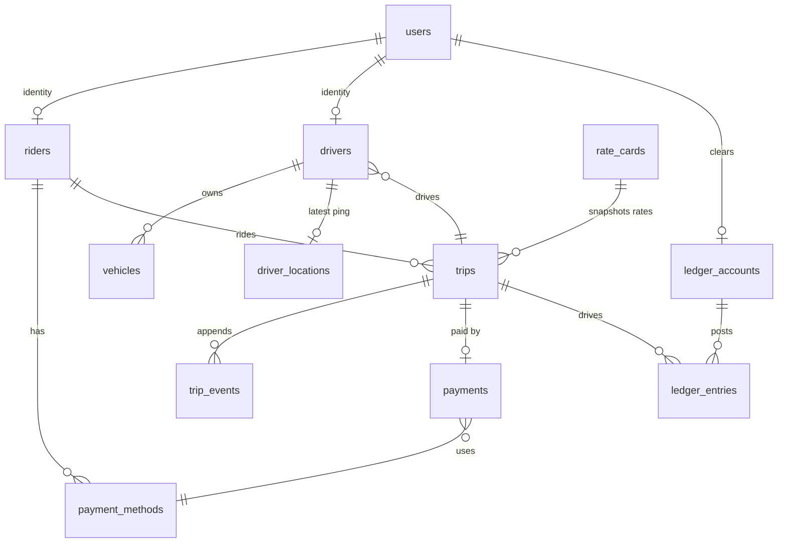

# Nimbus — On-Demand Ride-Hailing: API Design & Data Model

> **Status**: v1 design, pre-implementation. Companion artefacts in this directory:
> `migrations/0001_init_nimbus.sql` (PostgreSQL source of truth), `HARD_QUESTIONS.md` (the Step-3
> decisions: normalization, money, state, time, deletion, identifiers,
> constraints, indexes), and `model_proof.py` (runnable proof the model holds).
>
> **Every design decision below traces back to `REQUIREMENTS.md`**
> (product summary, the two personas, and the five most important user actions
> `ACT-1…ACT-5`). A rule that cannot be mapped to an action is out of v1 scope.
>
> This document is the contract a senior engineer signs off on before the first
> line of service code is written. Every business rule is numbered (`TRP-*`,
> `DRV-*`, `RDR-*`, `PAY-*`, `FEE-*`, `CUR-*`, `DEN-*`, `DEL-*`, `IDN-*`,
> `IDP-*`) and traced to the proof in §15.

---

## 1. Overview

Nimbus matches riders with nearby drivers for immediate point-to-point rides and
handles pricing, metering, dispatch, cancellation, and payment settlement. The
two sides of the marketplace (rider app / driver app) share one platform
backend; integrity of the *trip lifecycle* and of *money* are the two
non-negotiable guarantees.

## 2. Goals and Non-Goals

**Goals**

- A rider, driver, trip, and payments API with an intact money trail from quote
  → metered fare → captured payment → double-entry ledger.
- **No double assignment**: a driver can never be on two trips at once, and a
  rider can never hold two active trips.
- **No invented money**: a payment can only be created for a metered fare that
  already exists, in exactly the fare's amount, exactly once.
- The database, not just the application, rejects illegal states (§15 proves it).

**Non-Goals (v1)**

- Scheduled/advance bookings, multi-stop trips, pooling/shared rides, tips,
  cash rides, in-app driver payouts (payout batch job), OAuth SSO, a public
  developer portal, driver onboarding/background checks, and full GPS dispatch
  matching (nearest-driver heuristic only).

## 3. Terminology

| Term | Meaning |
|---|---|
| Rider | A user paying for rides. Auth via `riders.id` (FK to `users.id`). |
| Driver | A user accepting rides. Owns `vehicles`, has an availability state. |
| Trip | The core aggregate: one rider, ≤ one driver, one fare, one payment. |
| Methods | PSP-side payment instruments (card token / wallet) attached to a rider. |
| Fare | Metered cost at completion; the only amount that may be charged. |
| Quote | Estimated cost, frozen at request time from a rate card (incl. surge). |
| Ledger | Double-entry account balances (per rider, driver, and the platform). |
| Posting | A balanced DEBIT/CREDIT pair (see §8.3). |

## 4. High-Level Architecture

Single backend service (API monolith) over one PostgreSQL database, with a
server-sent message bus for platform events and a rule that **all mutations are
transactional and most are DB-guarded**.



Key decision: the pricing module (`compute_fare`) is a **pure function of
integer inputs** shared by the request-time quote and the completion-time fare.
Because both call the same function with the same frozen rate card, a completed
fare is always a deterministic function of a trip's actuals (§8.2).

## 5. Domain Model



### 5.1 Entity definitions (full DDL: `migrations/0001_init_nimbus.sql`; per-field tables: `DATA_MODEL.md`)

All primary keys are generated UUID v4 (IDN-01) — rationale in §9 and
`HARD_QUESTIONS.md` §6.

**users** — shared identity. `phone` is the login handle, unique, E.164.
`riders` and `drivers` are 1:1 profile rows so an account can later hold both
roles.

**riders** — `rating`, `rides_count`.

**drivers** — `status ∈ {OFFLINE, AVAILABLE, ON_TRIP}`. Invariant DRV-03: this
column is a **derived mirror** of the trips table, maintained by a DB trigger —
a driver cannot be "available" while an active trip row exists, and vice versa.

**vehicles** — `plate` unique, `capacity ∈ [1,8]`, `is_active`.

**driver_locations** — one row per driver holding the latest position ping.
High-frequency pings are UPSERTs here, never UPDATEs of `trips`.

**payment_methods** — `kind ∈ {CARD, WALLET}`; stores a PSP token, never a PAN;
`last4` only. Partial unique index enforces **≤ 1 default per rider** (RDR-02).

**rate_cards** — regional pricing: `currency` (CUR-01, v1 pinned `USD`),
`base_fare_cents`, `per_km_cents`, `per_min_cents`, `surge_max_bps`. A trip
snapshots these values so later price changes never rewrite history
(FEE-01 / DEN-1); a retired card is soft-deleted (`deleted_at`, DEL-01) so
past trips keep their FK.

**trips** — see §6 and §7. Columns are frozen at request (`quote_*`, rate
fields, `currency`), fixed at completion (`actual_*`, `fare_cents`,
`completed_at`), or incremental (`status`, `cancellation_fee_cents`). At
`MATCHED` the driver's display name and plate are snapshotted onto the row
(`driver_name_snapshot`, `vehicle_plate_snapshot` — DEN-2), so receipts never
change after a driver renames themselves or swaps cars. Submit only via the
status transition endpoints.

**trip_events** — append-only audit log, written by the DB on every status
change, in order (TRP-06). First-class evidence for disputes/chargebacks.

**payments** — **exactly one per trip** (UNIQUE `trip_id`), amount must equal
the metered fare (trigger PAY-04) **in the trip's currency** (CUR-01).
`status ∈ {PENDING, CAPTURED, FAILED, REFUNDED}`.

**ledger_accounts / ledger_entries** — double-entry. One account per rider,
one per driver, one platform clearing account. Entries are paired posting rows
grouped by `transaction_id` (see §8.3).

## 6. Trip State Machine

```mermaid
stateDiagram-v2
    [*] --> REQUESTED
    REQUESTED --> MATCHED : driver accepts (dispatch)
    REQUESTED --> CANCELLED : rider cancels
    MATCHED --> EN_ROUTE : driver heads to pickup
    MATCHED --> ARRIVED : driver arrives
    MATCHED --> CANCELLED : either party cancels
    EN_ROUTE --> ARRIVED : driver arrives
    EN_ROUTE --> CANCELLED : either party cancels
    ARRIVED --> ON_TRIP : driver starts the meter
    ARRIVED --> CANCELLED : rider cancels (flat fee)
    ON_TRIP --> COMPLETED : dropoff; fare materializes
    COMPLETED --> PAID : payment captured
    CANCELLED --> [*]
    PAID --> [*]
```



The legal edges live in the `trip_transitions` table; a BEFORE-UPDATE trigger
rejects any transition not listed there. Terminal states `PAID` and `CANCELLED`
have no outbound edges — a settled trip is immutable. (Proven: TRP-02a–d.)

## 7. Business Rules

| ID | Req | Rule | Enforced by |
|---|---|---|---|
| TRP-01 | ACT-1, ACT-4 | A rider holds **≤ 1 active trip**; a trip is active until `PAID` or `CANCELLED`. The rider must settle before requesting the next ride. | Partial unique index `uq_trips_one_active_per_rider` |
| TRP-02 | ACT-2, ACT-3, ACT-5 | Trip status may only change along a legal edge; terminal states are irreversible. | `trip_transitions` + trigger |
| TRP-03 | ACT-2 | `REQUESTED` has no driver; `MATCHED…ON_TRIP` must have one. | `CHECK` on `trips.status`/`driver_id` |
| TRP-04 | ACT-3 | `fare_cents` and `completed_at` become non-null **together**, only at `COMPLETED`. | `CHECK trips_fare_sets_on_completion` |
| TRP-05 | ACT-5 | Cancellation is only allowed from `REQUESTED/MATCHED/EN_ROUTE/ARRIVED`. | `trip_transitions` |
| TRP-06 | ACT-3 | Every status change is appended to `trip_events`, in order. | DB trigger |
| DRV-01 | ACT-2 | A driver holds **≤ 1 active trip** (from `MATCHED` through `ON_TRIP`). | Partial unique index `uq_trips_one_active_per_driver` |
| DRV-02 | ACT-2 | A trip can only be MATCHED to a driver whose status is `AVAILABLE`. | Trigger on dispatch |
| DRV-03 | ACT-2 | `drivers.status` is a trigger-maintained mirror of the trips table. | Trigger |
| DRV-04 | ACT-2 | Going `ONLINE` requires an enabled, active vehicle; declining `OFFLINE` mid-trip is rejected. | Application |
| RDR-01 | ACT-1 | A rider must have ≥ 1 payment method to request a ride. | Application |
| RDR-02 | ACT-1 | At most one default payment method per rider. | Partial unique index |
| PAY-01 | ACT-4 | A trip has **exactly one** payment. | UNIQUE `payments.trip_id` |
| PAY-02 | ACT-4 | `COMPLETED → PAID` requires an existing captured payment. | Trigger |
| PAY-03 | ACT-4 | Every posting balances: ΣDEBIT = ΣCREDIT per `transaction_id`. | Trigger |
| PAY-04 | ACT-4 | A payment amount must equal the trip's metered fare; no charge before a fare exists. | Trigger on `payments` insert |
| FEE-01 | ACT-1 | Rates are snapshotted onto the trip at request (denormalization DEN-1); later changes never rewrite it. | Schema (copied columns) |
| FEE-02 | ACT-1 | Quote = `ceil_to_dollar(rate(estimates) × surge)`. | Pricing module |
| FEE-03 | ACT-1 | Surge is clamped to `surge_max_bps` per rate card (100–400). | `CHECK` |
| FEE-04 | ACT-3 | Completed fare = `ceil_to_dollar(rate(actuals) × surge)`. | Pricing module |
| FEE-05 | ACT-5 | A cancellation fee may only exist on a `CANCELLED` trip. | `CHECK` |
| FEE-06 | ACT-5 | Cancellation fee: **$0.00** before the driver arrives; **$5.00 flat** from `ARRIVED` on. | Application + `CHECK` |
| FEE-07 | ACT-5 | The fee settles as a balanced `CANCELLATION_FEE` pair to the driver. | Ledger trigger |
| FEE-08 | ACT-4 | Platform commission: 20% of metered fare, on completed trips only. | Application on settlement |
| CUR-01 | ACT-1, ACT-4 | Money chain: a trip carries its rate card's currency, a payment its trip's currency; every money-bearing table has a `currency` column (v1 `CHECK = 'USD'`). | CHECKs + triggers |
| DEN-2 | ACT-2, ACT-3 | Driver display name + plate are snapshotted onto the trip at `MATCHED`. | `CHECK trips_snapshot_with_driver` |
| DEL-01 | ACT-1, ACT-4 | Reference data (vehicles, payment methods, rate cards) is soft-deleted; transactional records (trips, events, payments, ledger entries) are never deleted. | `deleted_at` columns |
| IDN-01 | ACT-1 through ACT-5 | Identifiers are generated UUID v4 — non-sequential, non-guessable, non-enumerable. | `gen_random_uuid()` PKs |
| IDP-01 | ACT-4 | Every mutation is idempotent via `Idempotency-Key`. | `idempotency_keys` table + service |

## 8. Pricing, Payments, and the Ledger

### 8.1 Money discipline

- **Integer minor units everywhere** (cents). No `float`, ever.
- **A `currency` column beside every money field** (`rate_cards`, `trips`,
  `payments`, `ledger_accounts`, `ledger_entries`) — v1 pinned to `USD` by
  `CHECK`, so multi-currency later is a widened CHECK, not a migration (CUR-01).
- **The currency chain is closed by triggers**: a trip's currency must equal
  its rate card's, a payment's must equal its trip's (CUR-01a/b, proven in §15).
- The DB stores `*_cents` integers. The API ships monetary strings in the
  provider's minor-unit-safe form, e.g. `"13.00"` with `"currency":"USD"`.
- Conversion is centralized in one serialiser; nothing else knows about it.

### 8.2 Fare lifecycle

```
quote_total = ceil_to_dollar( (base + est_km·per_km + est_min·per_min) × surge )
fare        = ceil_to_dollar( (base + act_km·per_km + act_min·per_min) × surge )
```

Same pure function, same frozen rate card → the metered fare is a deterministic
function of actuals. The quote is never charged; only `fare` can become a
payment (PAY-04).

### 8.3 Double-entry ledger (proven, DB-enforced)

Settlement of fare **F** splits rider → driver → platform at commission rate
**c**, as **balanced postings through the platform as clearing counterparty**:

| transaction | DEBIT | CREDIT |
|---|---|---|
| `settle:<trip>` | rider −F (FARE) | platform +F (FARE) |
| `payout:<trip>` | platform −(F−c) (FARE) | driver +(F−c) (FARE) |
| `commission:<trip>` | platform −c (COMMISSION) | platform +c (COMMISSION) |

Every posting is an equal-legged pair, so the per-`transaction_id` balance
trigger (PAY-03) is strictly enforced without multi-leg intermediate states.
Net balances: rider −F, driver +(F−c), platform +c. A cancellation at `ARRIVED`
posts `fee:<trip>` as rider −$5 (CANCELLATION_FEE) ↔ driver +$5.

The PSP itself is treated as an **opaque authorizer**: we create a `payment`
row (`PENDING`) only at charge time, ask the PSP to authorize+capture, and mark
`CAPTURED`. A PSP webhook/mismatch flips it to `FAILED` and trips can never be
politely `PAID` (PAY-02), because failed capture → no PAID → the rider cannot
start another ride (TRP-01). This is the moneysafety deadlock we *want*: resolve
the payment, then ride again.

## 9. API Conventions

- **Base URL**: `https://api.nimbus.example.com/v1`; version in the path.
- **Auth**: `Authorization: Bearer <JWT>`. Claim `sub` = `users.id`,
  `role ∈ {RIDER, DRIVER}`. Refresh handled by a token endpoint (out of scope).
- **Money**: strings as in §8.1. **Lat/lng**: `WGS84` doubles to 6 decimals.
  **Distance** metres, **duration** seconds (integers).
- **Identifiers**: opaque UUID v4 strings (IDN-01) — non-sequential, so an id
  leaks nothing about volume and cannot be enumerated (§18 ADR-7). Short
  aliases in examples (`trip_9201`) are readability shorthand only.
- **Errors** (single envelope, `traceId` correlates logs):

  ```json
  { "error": { "code": "TRIP_ACTIVE_EXISTS", "message": "…", "traceId": "…" } }
  ```

- **Idempotency**: mutating endpoints require `Idempotency-Key`. The service
  stores the key, resource, and response; replays return the stored response.
  A dispatch racing from two drivers is *also* DB-safe (see §11).
- **Pagination**: cursor-based; `nextCursor` opaque, absent on last page.
- **Rate limits**: `429 + Retry-After`. Pings: 1/5 s per driver. Ride creation:
  10/min per rider. Dispatch accept: 10/min per driver.
- **Timestamps**: RFC 3339 UTC (`iso8601`) in requests; DB keeps
  `timestamptz`.

Error codes (non-exhaustive, stable): `NO_PAYMENT_METHOD`, `TRIP_ACTIVE_EXISTS`,
`DRIVER_UNAVAILABLE`, `DRIVER_BUSY`, `ILLEGAL_TRANSITION`, `FARE_NOT_SET`,
`PAYMENT_MISMATCH`, `ALREADY_PAID`, `IDEMPOTENCY_REPLAY`, `UNPROCESSABLE`.

## 10. Endpoints

### 10.1 Rider

| Method & path | Purpose | Rules |
|---|---|---|
| `GET /rider/me` | Profile + rating | RDR-* |
| `PATCH /rider/me` | Update name | |
| `GET /rider/me/payment-methods` | List tokens (no PAN) | |
| `POST /rider/me/payment-methods` `{ kind, provider_token, last4 }` | Add; first one becomes default | RDR-01 |
| `DELETE /rider/me/payment-methods/{id}` | Remove (not last default) | RDR-02 |
| `PATCH /rider/me/payment-methods/{id}/default` | Promote default | RDR-02 |
| `GET /rider/me/trips?status=&cursor=` | Trip history | TRP-01 |

### 10.2 Driver

| Method & path | Purpose | Rules |
|---|---|---|
| `GET /driver/me` | Profile, vehicle, status, earnings | |
| `PATCH /driver/me/status` `{ status: ONLINE|OFFLINE }` | Toggle availability | DRV-03/04 |
| `PUT /driver/me/location` `{ lat, lng, ts }` | Position ping (UPSERT) | |
| `GET /driver/me/vehicles` / `POST /driver/me/vehicles` | Vehicle management | DRV-04 |
| `GET /driver/me/trips` | Trip history + earnings | |
| `GET /driver/me/earnings?from=&to=` | Ledger credit sum for range | PAY-03 |

### 10.3 Trips (core)

**Request a ride**

```
POST /trips
Authorization: Bearer <rider>
{
  "pickup":     { "lat": 37.7749,  "lng": -122.4194 },
  "dropoff":    { "lat": 37.7849,  "lng": -122.4094 },
  "rate_card":  "SFO-default",
  "estimate":   { "km": 5, "minutes": 10 },        // optional; server can estimate
  "payment_method_id": 101
}
Idempotency-Key: req-100
```

`201 Created`

```json
{
  "id": "trip_9201", "status": "REQUESTED",
  "quote_total": "15.00", "quote_currency": "USD",
  "surge_multiplier": "1.50",
  "payment_method_id": 101,
  "pickup": { "lat": 37.7749,  "lng": -122.4194 },
  "dropoff": { "lat": 37.7849,  "lng": -122.4094 },
  "eta_seconds": 240,
  "created_at": "2026-09-23T10:00:00Z"
}
```
`400 NO_PAYMENT_METHOD` · `409 TRIP_ACTIVE_EXISTS` · `422` bad coords.
The trip is created in `REQUESTED` with the frozen quote (FEE-01/02). The
server-side `estimate` may be route-service data; both event fields remain
frozen on the row.

**Accept (dispatch)**

```
POST /trips/{id}/accept
Authorization: Bearer <driver>
```
`200 { "trip": { …status: "MATCHED", driver… } }`
`409 DRIVER_BUSY` · `409 DRIVER_UNAVAILABLE` · `422 ILLEGAL_TRANSITION`.
First writer wins: the DB's availability trigger + the driver partial unique
index reject all losers atomically (TRP-01, DRV-01, DRV-02 — see §11).

**Driver lifecycle** (all `POST /trips/{id}/{action}`, driver role):

| Action | Transition | Notes |
|---|---|---|
| `/navigate` | `MATCHED → EN_ROUTE` | sets `accepted_at` |
| `/arrive` | `MATCHED\|EN_ROUTE → ARRIVED` | opens the cancellation-fee window (FEE-06) |
| `/start` | `ARRIVED → ON_TRIP` | starts meter |
| `/complete` | `ON_TRIP → COMPLETED → PAID` | fare computed, payment captured, ledger settled in one transaction |

Example `POST /trips/trip_9201/complete`:
`{ "actual": { "km": 4, "minutes": 8 } }`

`200`

```json
{
  "id": "trip_9201", "status": "PAID",
  "fare_total": "13.00", "currency": "USD",
  "breakdown": { "base": "2.50", "distance": "3.20", "time": "2.40",
                 "surge": "1.50", "rounded_total": "13.00" },
  "commission": "2.60", "payment": { "status": "CAPTURED", "method": "card •••• 4242" }
}
```
`422 FARE_NOT_SET` if requested from a non-`ON_TRIP` trip.

**Cancel**

```
POST /trips/{id}/cancel
{ "by": "RIDER", "reason": "waited_too_long" }
```
`200 { "status": "CANCELLED", "cancellation_fee": "5.00" }`
`422 ILLEGRAL_TRANSITION` from `COMPLETED/PAID`. Fee is $0 unless the trip
reached `ARRIVED` (FEE-06); the DB refuses a fee on a non-CANCELLED trip and
the ledger posts the FEE-07 pair.

**Receipt / history**

`GET /trips/{id}` — full trip incl. `quote_total`, `fare_total`, `payment`,
`events` (from `trip_events`, TRP-06). `GET /trips/{id}/receipt` — PDF-able
summary (v1 just JSON).

### 10.4 Ledger queries

`GET /rider/me/ledger` → `{ balance: "-1365.00", currency: "USD" }`
`GET /driver/me/earnings?from&to` → `{ total: "1040.00", postings: [ … ] }`
Both are pure `SUM` over `ledger_entries` (PAY-03) — no cached balances to
drift.

## 11. Consistency and Concurrency

- **Every mutation runs in one DB transaction**; the sequence `complete`
  is atomic: status → payment → capture → ledger → PAID. If any step fails,
  nothing is half-applied and the trip stays `ON_TRIP` (retryable, IDP-01).
- **The unique partial indexes are the concurrency bedrock.** Two drivers racing
  to accept trip X: both pass the app layer, both attempt
  `REQUESTED → MATCHED`; the transition trigger admits the first, the second
  gets `DRIVER_BUSY` (already `ON_TRIP`) or hits the driver unique index.
  There is no lost-update window — enforcement is at the row, not a lock.
- **Reads** prefer the primary connection or lag ≤ 100 ms replicas (metrics,
  history, receipts). Writes always hit primary.
- **Location pings** are UPSERTs independent of trip state — never block the
  dispatch path.

## 12. Events (outbox → topic)

The service appends to an outbox table inside the same transaction as the
mutation, ships to the bus after commit:

`trip.created`, `trip.matched`, `trip.driver_en_route`, `trip.driver_arrived`,
`trip.started`, `trip.completed`, `trip.paid`, `trip.cancelled`,
`payment.captured`, `payment.failed`.

Consumers (notifications, driver offers, analytics) may already exist
independently; the `trip_events` table is the durable source for replays.

## 13. Over-Fetching Analysis

Every one of the five actions reads a **narrow, index-served slice**; nothing
returns a whole row just to use one column. Per-trip the data is already bounded
finger-tight (a trip is one invoice); the audit below is about not widening it.

| Action | Read | Round trips | Columns fetched | Serving index |
|---|---|---|---|---|
| ACT-1 request | `queries/01_act1_request.sql` | 1 (single-row PM + inline existence subquery) | `id, kind, last4`, `count(open_trips)` | `uq_payment_default_per_rider`, `uq_trips_one_active_per_rider` |
| ACT-2 dispatch | `queries/02_act2_dispatch.sql` | 1 | `id, full_name, plate, vehicle, lat, lng` (top 3) | `idx_drivers_available` |
| ACT-3 complete | `queries/03_act3_complete.sql` | 2 (trip row + timeline) | snapshot columns; `trip_events` trail | `trips` PK, `idx_trip_events_trip` |
| ACT-4 settle | `queries/04_act4_settle.sql` | 2 (postings + payment aggregate) | leg columns; `count + captured` flag — never full history | `idx_ledger_entries_trip` |
| ACT-5 cancel | `queries/05_act5_cancel.sql` | 1 | 5 columns incl. `cancellation_fee_cents` | `trips` PK |

Anti-over-fetch rules the endpoints inherit from the queries:

- **No N+1, anywhere.** The 31/31 proof and the Step-5 plan check cover the two
  heaviest (dispatch join, settle trail); the other three are single-row or
  index-only reads. A trip list is `ORDER BY requested_at DESC` on
  `idx_trips_rider_history` + keyset pagination, never `OFFSET` over the whole
  table.
- **Ledger reads are aggregate-only.** `GET /rider/me/ledger` and
  `/driver/me/earnings` are `SUM` over the posting index (§10.4). The full
  posting set is exposed only for the one-trip audit trail (ACT-4).
- **Event trails are paginated** by `(trip_id, created_at)` — an append-only
  log returns the tail, not the history, and replays stream from it (§12).
- **Cents ship as strings** (ADR-1). No floats, no `Decimal`, no `bigint`
  exceeding JS-safe integers in JSON — the value is not widened to keep
  serialisation simple.
- **Location data is one row per driver** (`driver_locations`, 1:1, UPSERT).
  Dispatch reads the `AVAILABLE` pre-filter from the partial index and folds in
  distance on a bounded candidate set; a GiST radius pre-select remains a
  service-layer extension (§8 of `HARD_QUESTIONS.md`), not a client payload.

Cost posture: the widest request a rider can make — receipt history — serves
from `idx_trips_rider_history`; the widest on the driver side — postings
within a window — serves from `idx_ledger_entries_account`. Neither touches the
`trips` invoice beyond the receipt row.

## 14. Real-Time Analysis

Four consumers need live data, with very different cadences:

| Consumer | Needs | Source | Cadence |
|---|---|---|---|
| Rider app | trip progression `MATCHED → … → COMPLETED`; driver location during `EN_ROUTE → ON_TRIP` | outbox events (§12); `driver_locations` row | event-driven push; location 5s ping |
| Driver app | candidate offers for nearby `REQUESTED` trips; own trip mirrors | outbox events (§12) | event-driven push |
| Dispatch service | fresh `AVAILABLE` set + distance | `idx_drivers_available` + `driver_locations` | query-on-demand, ≤ 5s staleness |
| Notifications / analytics | lifecycle + payment events | `trip_events` (durable), outbox | batch / replay |

Transport decision — **push for state, poll/slice for position:**

- **State progression** (trip lifecycle, offers) is pushed over a WebSocket
  channel that consumes the outbox→topic events (§12). It is the only way to
  meet the <2 min P95 lifecycle and the p99 < 1 s API budget (§16/§9) without
  every client polling a state table. Fan-out is **bounded to the trip
  participants** — at most two sockets per trip, so there is no broadcast storm.
- **Driver position** is *not* an event: pings are high-frequency (5s) telemetry
  with no business semantics, so they never touch the outbox or the bus. They
  are a pure UPSERT into `driver_locations` (independent of trip state, never
  blocking dispatch — §11). The rider sees the driver's row via a quiet,
  throttled slice while the trip is `EN_ROUTE → ON_TRIP` (GET or a low-rate WS
  message), and never otherwise — anonymity protects the driver off-trip.
- **Offers use the accept model** (ADR-6). Dispatch writes a `REQUESTED` trip;
  the offer is delivered as an event; the first driver to accept wins at the
  DB transition trigger (`REQUESTED → MATCHED`), which is the same
  first-writer resolution proven in §15. Nobody pushes "the" answer —
  the DB decides.

Consistency contract: **the real-time channel is a convenience, never the
source of truth.** A WS message can be dropped; a socket can die. Every client
re-syncs with the authoritative `GET` on reconnect, and replays come from
`trip_events` (§12). The database (trigger-enforced transitions + partial
indexes) is where a legal state is *defined*; the stream only tells participants
to look. This is the same split as §11 — writes and truth on the primary, read
convenience at the edge.

Failure modes and backpressure:

- **Backpressure**: the outbox is drained with a bounded batch (per §12); if a
  consumer stalls, the topic buffers and `trip_events` remains the replay
  source — no in-flight state is ever the only copy.
- **Rate limiting** (§16): pings are throttled so telemetry cannot starve the
  primary; the location UPSERT is `driver_id`-keyed, so a single driver's
  floods cancel to one write window.
- **Stale-position safety**: dispatch treats location as *best-effort*; the
  invariant that matters (one active trip per driver) is the trigger + partial
  index, not how fresh the GPS row is.

## 15. Proof the Model Holds

`migrations/0001_init_nimbus.sql` is mirrored verbatim-semantics into SQLite
(`design/ride-hailing/model_proof.py`) — same `CHECK`s, partial unique indexes,
and `RAISE(ABORT)` triggers — and the script **attempts to violate every rule**.

```bash
python3 design/ride-hailing/model_proof.py
```

Latest run: **31 checks passed, 0 failed — the model holds.**

The same DDL is additionally proven on a **real PostgreSQL 14 server** in
Step 5: migration + seed applied, the five action queries run
(`queries/01…05_*.sql`), `EXPLAIN` confirms `idx_drivers_available` and
`idx_ledger_entries_trip` are used, and three invalid states are rejected by
three different enforcement layers (partial index, trigger, CHECK).
See `STEP5_PROOF.md`; reproduce with:

```bash
bash design/ride-hailing/step5_run.sh
```

| Proof step | Demonstrates |
|---|---|
| IDN-01 | trip identifiers are generated 32-char UUIDs, not sequential integers |
| TRP-01a | quote is frozen at request: `quote_total == “15.00”`, `REQUESTED`, no driver |
| TRP-01b | second request for the same rider → **rejected** (partial index) |
| DRV-02a | dispatch to an `AVAILABLE` driver succeeds; driver mirrors `ON_TRIP` |
| DEN-2 | driver name + plate are snapshotted onto the trip at `MATCHED` |
| TRP-02a / c | `MATCHED→COMPLETED` and `ARRIVED→COMPLETED` (skipped states) → **rejected** |
| DRV-02b | a busy driver cannot be dispatched a second trip → **rejected** |
| TRP-03b | `ARRIVED→ON_TRIP` is the only forward move |
| PAY-04a | charging a trip with no fare yet → **rejected** |
| FEE-04 | completion materializes the metered fare (1300¢) exactly |
| DRV-03 | driver auto-released to `AVAILABLE` on completion |
| PAY-01a/b | capture succeeds; **second** payment for the trip → **rejected** |
| PAY-04b | payment for a wrong amount → **rejected** |
| CUR-01a / CUR-01b | payment in the wrong currency and trip in the wrong currency → **rejected** |
| PAY-03a | settlement balances: rider −1300¢, driver +1040¢, platform +260¢ |
| PAY-03b / c | unbalanced pair and duplicated leg → **rejected** |
| PAY-02a / b / c | `PAID` blocked without a captured payment; allowed once captured |
| FEE-06 / 07 | `ARRIVED` cancellation → $5.00 fee settles rider→driver |
| TRP-02d | terminal `CANCELLED` cannot be revived |
| TRP-01c | the settle-first gate lifts after `PAID` (rider may ride again) |
| TRP-06 | audit trail equals the exact applied transition order |
| DEL-01 | a soft-deleted payment method is hidden from lists; its payment rows survive |

## 16. Non-Functionals, Security, Privacy

- **Money**: cents at rest; `Decimal`/int math; never floats. Fail closed.
- **AuthZ**: every endpoint checks the JWT `role` claim; a rider token can never
  accept a trip. Actions on a trip verify the caller is the trip's
  participant (owner checks server-side).
- **Privacy**: the PSP token is the only stored instrument data; PANs never
  touch our systems/DB. Location data min-retained for trip duration + 30 days.
- **Rate limiting** per §9; pings throttled to protect the primary.
- **Observability**: `traceId` on every error; p50 < 300 ms for trip lifecycle,
  p99 < 1 s; alert on capture failure rate > 0.1% and dispatch p99 > 2 s.
- **Compliance notes** (record for later review): PCI via PSP in-house
  (v1 uses a hosted field/token flow), GDPR right-of-erasure → cascade from
  `users` (§5.1), driver earnings reporting.

## 17. Migration / Rollout Notes

Single `migrations/0001_init_nimbus.sql` migration, additive-only on deploy (new tables + triggers).
Backfill: create `ledger_accounts` for existing riders/drivers; one
`settle/…`+`payout/…`+`commission/…` reconstruction job for the pilot dataset,
validated against the same balance trigger. Feature flags: driver lifecycle
endpoints behind `T25…` flag until dispatch telemetry is green.

## 18. Decisions Log (abridged ADR)

Every decision also traces to a requirements-row (`ACT-x`) on the requirements page.

| # | Req | Decision | Alternative rejected | Why |
|---|---|---|---|---|
| ADR-1 | ACT-4 | Money as **integer cents** + string JSON | `Decimal`, floats | Exactness; simplest serialisation |
| ADR-2 | ACT-4 | Pairwise balanced posting through platform clearing account | One 3-leg txn per settlement | Lets the DB enforce balance per transaction without intermediate unbalanced states |
| ADR-3 | ACT-2/3/5 | Trip state machine enforced **in the DB** | App-only FSM | Contract-style guarantee; proof runs against the DB itself |
| ADR-4 | ACT-2 | `drivers.status` as trigger-maintained mirror | Standalone column managed by app | Cannot drift from trips (DRV-03) |
| ADR-5 | ACT-1, ACT-4 | Settle-before-riding for riders (TRP-01) | Allow next ride while prior unpaid | Moneysafety: a rider cannot accumulate an unpayable debt in v1 |
| ADR-6 | ACT-2 | Dispatch = **accept model**, first writer wins | Push + decline/reassign | No extra transition edges; racy accepts are inherently resolved |
| ADR-7 | ACT-1…ACT-5 | Primary keys = **generated UUID v4** (IDN-01) | `SERIAL`/sequential ints; natural keys | Ids are bearer-visible (receipts, URLs); UUIDs leak no volume and cannot be enumerated; merge-safe across region shards |

## 19. Open Questions (explicitly unresolved)

1. Surge policy is regional; is dynamic pricing out of v1 scope? (Schema
   supports a fixed snapshot either way.)
2. Are payments authorized at `MATCHED` (escrow-style) or only at `COMPLETED`?
   The model stores a single charge; the PSP-side hold is currently out-of-band.
3. Driver payouts: ledger accumulates credit but v1 has no disbursement
   pipeline. Needs a bank/token field + job.
4. Who eats PSP fees, and does v1 need a `REFUND` anatomy (partial refunds)?
5. Multi-currency: v1 pins `USD` on every money-bearing table (`currency`
   columns + `CHECK`s exist, CUR-01). Expanding = widening those CHECKs and
   adding FX-conversion postings on the ledger — a policy decision, not a
   schema change.
6. Cancellation fee escalation (repeat offenders, driver-initiated cancel)
   is policy, not schema — confirm bounds before pricing module finalization.

---

*End of design. Schema: `migrations/0001_init_nimbus.sql` · Decisions: `HARD_QUESTIONS.md` · Proof: `model_proof.py` (31/31 green) + `STEP5_PROOF.md` (real PostgreSQL).*