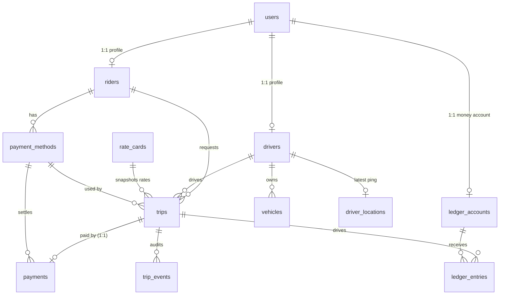

# Nimbus — Data Model (Step 2)

*Every entity and relationship below mirrors `migrations/0001_init_nimbus.sql` exactly — nothing in
the design nor the proof may disagree with this page. Key: **`Req` = NOT NULL
(Y/N)**; **PK** = primary identifier; **FK** = foreign key. Money is integer
cents (`*_cents`); money, distance (km), and duration (minutes) are integers.*

**Identifiers are generated UUID v4** (`gen_random_uuid()`) on every table --
never sequential integers (**IDN-01**). The full Step-3 rationale
(normalization, money, state machine, time, soft deletion, identifiers,
constraints, per-query indexes) is written up in `HARD_QUESTIONS.md`. Mutable
tables carry `created_at` + a trigger-maintained `updated_at`; append-only
tables carry `created_at` only.

---

## 1. Entity Inventory

### 1.1 `users` — *identity*
The single account/login identity. Riders and drivers are 1:1 *profiles* of a
user, so one account can hold both roles later.
Identifier: **PK `id: UUID`** (generated, IDN-01).

| Field | Type | Req | Notes |
|---|---|---|---|
| **id** | UUID | Y | PK, generated |
| full_name | TEXT | Y | `char_length 1…120` |
| phone | TEXT | Y | UNIQUE, E.164 `+…` (`CHECK` regex) |
| password_hash | TEXT | N | null reserved for future OAuth |
| created_at / updated_at | TIMESTAMPTZ | Y | `updated_at` set by trigger |

### 1.2 `riders` — *rider profile*
The rider side of a `users` row: holds ride statistics for that role.
Identifier: **PK `id: UUID`** = `users.id` (FK), 1:1.

| Field | Type | Req | Notes |
|---|---|---|---|
| **id** | UUID | Y | PK, FK→`users.id` (`ON DELETE CASCADE`) |
| rating | NUMERIC(2,1) | N | `0.0…5.0` w/ nullable |
| rides_count | INT | Y | `≥ 0`, default 0 (denormalized counter) |
| created_at / updated_at | TIMESTAMPTZ | Y | `updated_at` set by trigger |

### 1.3 `drivers` — *driver profile + availability*
The driver side of a `users` row. `status` is a **trigger-maintained mirror**
of the trips table (DRV-03): a driver is `ON_TRIP` iff an active trip row has
them as `driver_id`.
Identifier: **PK `id: UUID`** = `users.id` (FK), 1:1.

| Field | Type | Req | Notes |
|---|---|---|---|
| **id** | UUID | Y | PK, FK→`users.id` (`ON DELETE CASCADE`) |
| status | TEXT | Y | `OFFLINE / AVAILABLE / ON_TRIP`; default `OFFLINE` |
| rating | NUMERIC(2,1) | N | `0.0…5.0` w/ nullable |
| rides_count | INT | Y | `≥ 0`, default 0 (denormalized counter) |
| created_at / updated_at | TIMESTAMPTZ | Y | `updated_at` set by trigger |

### 1.4 `vehicles` — *a driver's car*
A registered, drivable vehicle owned by a driver.
Identifier: **PK `id: UUID`** (generated, IDN-01).

| Field | Type | Req | Notes |
|---|---|---|---|
| **id** | UUID | Y | PK |
| driver_id | UUID | Y | FK→`drivers.id` (`ON DELETE CASCADE`) |
| make | TEXT | Y | |
| model | TEXT | Y | |
| plate | TEXT | Y | UNIQUE |
| capacity | INT | Y | `1…8` |
| is_active | BOOLEAN | Y | default `true` |
| deleted_at | TIMESTAMPTZ | N | soft delete (DEL-01): historical plate survives |
| created_at / updated_at | TIMESTAMPTZ | Y | `updated_at` set by trigger |

### 1.5 `driver_locations` — *latest-known position ping*
The most recent GPS position a driver reported. **UPSERT target** for
high-frequency pings; keeps pings from churning `trips` rows.
Identifier: **PK `driver_id: UUID`** = `drivers.id` (FK), 1:1.

| Field | Type | Req | Notes |
|---|---|---|---|
| **driver_id** | UUID | Y | PK, FK→`drivers.id` (`ON DELETE CASCADE`) |
| lat | DOUBLE PRECISION | Y | `−90…90` |
| lng | DOUBLE PRECISION | Y | `−180…180` |
| captured_at | TIMESTAMPTZ | Y | |

### 1.6 `payment_methods` — *a rider's billing instrument*
A PSP-side token representing a rider's saved card or wallet. No PAN is ever
stored (PCI: tokenized instrument only).
Identifier: **PK `id: UUID`** (generated, IDN-01).

| Field | Type | Req | Notes |
|---|---|---|---|
| **id** | UUID | Y | PK |
| rider_id | UUID | Y | FK→`riders.id` (`ON DELETE CASCADE`) |
| kind | TEXT | Y | `CARD / WALLET` |
| provider_token | TEXT | Y | PSP token; never raw PAN |
| last4 | CHAR(4) | N | if present `^\d{4}$` |
| is_default | BOOLEAN | Y | default `false`; **≤ 1 true per rider** (partial unique index `uq_payment_default_per_rider`) |
| deleted_at | TIMESTAMPTZ | N | soft delete (DEL-01): hidden from lists, FKs keep resolving |
| created_at / updated_at | TIMESTAMPTZ | Y | `updated_at` set by trigger |

### 1.7 `rate_cards` — *regional pricing definition*
A named set of base rates + surge ceiling used to price trips.
Identifier: **PK `id: UUID`** (generated, IDN-01).

| Field | Type | Req | Notes |
|---|---|---|---|
| **id** | UUID | Y | PK |
| name | TEXT | Y | e.g. `SFO-default` |
| currency | TEXT | Y | default `USD`, `CHECK = 'USD'` (CUR-01) |
| base_fare_cents | INT | Y | `≥ 0` |
| per_km_cents | INT | Y | `> 0` |
| per_min_cents | INT | Y | `> 0` |
| surge_max_bps | INT | Y | `100…400` basis points; default 300 |
| is_active | BOOLEAN | Y | default `true` |
| deleted_at | TIMESTAMPTZ | N | soft delete (DEL-01): past trips keep the FK |
| created_at / updated_at | TIMESTAMPTZ | Y | `updated_at` set by trigger |

### 1.8 `trips` — *the ride itself (core aggregate)*
One rider, at most one driver, one frozen pricing snapshot, one lifecycle, and
one terminal state (`PAID` or `CANCELLED`). Request-time fields are frozen at
`REQUESTED`; fare fields materialize together at `COMPLETED`.
Identifier: **PK `id: UUID`** (generated, IDN-01).

| Field | Type | Req | Notes |
|---|---|---|---|
| **id** | UUID | Y | PK |
| rider_id | UUID | Y | FK→`riders.id` |
| driver_id | UUID | N | FK→`drivers.id`; set only at `MATCHED` (TRP-03 `CHECK`) |
| status | TEXT | Y | `REQUESTED…CANCELLED`; default `REQUESTED` |
| payment_method_id | UUID | N | FK→`payment_methods.id` |
| pickup_lat / pickup_lng | DOUBLE PRECISION | Y | `CHECK` bounds |
| dropoff_lat / dropoff_lng | DOUBLE PRECISION | Y | `CHECK` bounds |
| rate_card_id | UUID | Y | FK→`rate_cards.id` |
| currency | TEXT | Y | default `USD`, `CHECK = 'USD'`; **must equal the rate card's** (CUR-01) |
| base_fare_cents / per_km_cents / per_min_cents | INT | Y | frozen from rate card (FEE-01 / DEN-1) |
| surge_bps | INT | Y | frozen; `100…400` |
| estimated_km / estimated_minutes | INT | Y | `> 0` |
| quote_total_cents | INT | Y | `> 0`; the price shown at request |
| actual_km / actual_minutes | INT | N | set at `COMPLETED` |
| fare_cents | INT | N | metered fare; non-null iff terminal `COMPLETED/PAID` (TRP-04) |
| cancellation_fee_cents | INT | Y | default 0; `> 0` only on `CANCELLED` (FEE-05) |
| cancelled_by | TEXT | N | `RIDER / DRIVER / SYSTEM / PAYMENT` (actor enum) |
| cancel_reason | TEXT | N | |
| driver_name_snapshot / vehicle_plate_snapshot | TEXT | N | frozen at `MATCHED` (DEN-2); required whenever `driver_id` is set |
| requested_at / accepted_at / completed_at | TIMESTAMPTZ | Y/N | `requested_at` Y (default `now()`); `accepted_at`/`completed_at` N |
| updated_at | TIMESTAMPTZ | Y | default `now()` |

Uniqueness (non-PK): partial unique `uq_trips_one_active_per_rider`
(`WHERE status NOT IN ('CANCELLED','PAID')`); partial unique
`uq_trips_one_active_per_driver` (`WHERE status IN ('MATCHED'…'ON_TRIP')`) —
**TRP-01 / DRV-01, enforced by the indexes, not the app.**

### 1.9 `trip_events` — *append-only audit trail*
One row per trip creation or status change, written by a DB trigger (TRP-06).
Identifier: **PK `id: UUID`** (generated, IDN-01).

| Field | Type | Req | Notes |
|---|---|---|---|
| **id** | UUID | Y | PK |
| trip_id | UUID | Y | FK→`trips.id` (`ON DELETE CASCADE`) |
| from_status | TEXT | N | null for the creation row |
| to_status | TEXT | Y | |
| actor | TEXT | Y | `RIDER / DRIVER / SYSTEM / PAYMENT`; default `SYSTEM` |
| payload | JSONB | Y | default `{}` — reason, coords, etc. |
| created_at | TIMESTAMPTZ | Y | default `now()` |

### 1.10 `trip_transitions` — *the legal state machine (reference table)*
The only legal status edges; consulted by the transition-guard trigger (TRP-02).
Not a domain entity — a lookup/config row set.
Identifier: **PK (from_status, to_status)**.

| Field | Type | Req | Notes |
|---|---|---|---|
| from_status / to_status | TEXT | Y | composite PK; terminal states have no outbound rows |

### 1.11 `payments` — *the single charge for a trip*
Exactly one per trip; amount must equal the metered fare (PAY-01/04, DB-enforced).
Identifier: **PK `id: UUID`** (generated, IDN-01). **UNIQUE `trip_id`** enforces 1:1.

| Field | Type | Req | Notes |
|---|---|---|---|
| **id** | UUID | Y | PK |
| trip_id | UUID | Y | FK→`trips.id`, **UNIQUE** |
| payment_method_id | UUID | N | FK→`payment_methods.id` |
| amount_cents | INT | Y | `> 0`; `= trips.fare_cents` (trigger PAY-04) |
| currency | TEXT | Y | default `USD`; **must equal the trip's** (CUR-01) |
| status | TEXT | Y | `PENDING / CAPTURED / FAILED / REFUNDED` |
| provider_txn_id | TEXT | N | PSP reference |
| captured_at | TIMESTAMPTZ | N | |
| created_at | TIMESTAMPTZ | Y | default `now()` (append-only) |

### 1.12 `ledger_accounts` — *who holds money in the ledger*
One account per rider, one per driver, plus one platform clearing account.
Identifier: **PK `id: UUID`** (generated, IDN-01). **UNIQUE (owner_type, owner_id)**.

| Field | Type | Req | Notes |
|---|---|---|---|
| **id** | UUID | Y | PK |
| owner_type | TEXT | Y | `RIDER / DRIVER / PLATFORM` |
| owner_id | UUID | N | `users.id` for RIDER/DRIVER; **NULL** for the platform account |
| currency | TEXT | Y | default `USD`, `CHECK = 'USD'` (CUR-01) |
| created_at / updated_at | TIMESTAMPTZ | Y | `updated_at` set by trigger |

### 1.13 `ledger_entries` — *the double-entry posting rows*
The money trail. Legs are grouped by `transaction_id`; each group must balance
ΣDEBIT = ΣCREDIT (PAY-03, DB-enforced). **No balance caching** — balances are
derived by `SUM`.
Identifier: **PK `id: UUID`** (generated, IDN-01).

| Field | Type | Req | Notes |
|---|---|---|---|
| **id** | UUID | Y | PK |
| transaction_id | UUID | Y | groups the DEBIT leg with its CREDIT leg(s) |
| account_id | UUID | Y | FK→`ledger_accounts.id` |
| trip_id | UUID | N | FK→`trips.id`; null only for system postings |
| entry_type | TEXT | Y | `FARE / CANCELLATION_FEE / COMMISSION / REFUND` |
| side | TEXT | Y | `DEBIT / CREDIT` |
| amount_cents | INT | Y | `> 0` |
| currency | TEXT | Y | default `USD`, `CHECK = 'USD'` (CUR-01) |
| created_at | TIMESTAMPTZ | Y | default `now()` (append-only) |

Secondary: **UNIQUE (transaction_id, side, entry_type)** blocks accidental
re-posting of a leg.

### 1.14 `idempotency_keys` — *replay protection*
Stores the request + stored response per idempotent mutations (IDP-01).
Identifier: **PK `key: TEXT`** (client-supplied `Idempotency-Key`).

| Field | Type | Req | Notes |
|---|---|---|---|
| **key** | TEXT | Y | PK |
| scope | TEXT | Y | e.g. `trips.complete` |
| resource_type / resource_id | TEXT / UUID | Y | e.g. `trip` / the created trip's id |
| request_hash | TEXT | Y | detects a changed request on same key |
| response | JSONB | N | stored response returned on replay |
| created_at | TIMESTAMPTZ | Y | default `now()` |

---

## 2. Relationships (all pairs)

### 2.1 Cardinality one-to-one (1:1)

| Pair | Cardinality | Enforced by | Meaning |
|---|---|---|---|
| `users` ↔ `riders` | **1:1** | `riders.id` PK→`users.id` | a user has at most one rider profile |
| `users` ↔ `drivers` | **1:1** | `drivers.id` PK→`users.id` | a user has at most one driver profile |
| `users` ↔ `ledger_accounts` | **1:1** | `ledger_accounts` UNIQUE (owner_type=RIDER\|DRIVER, owner_id) | one money account per rider/driver |
| `drivers` ↔ `driver_locations` | **1:1** | `driver_locations.driver_id` PK→`drivers.id` | one latest ping per driver |
| `trips` ↔ `payments` | **1:1** | `payments.trip_id` **UNIQUE** | each trip is charged exactly once (PAY-01) |

### 2.2 Cardinality one-to-many (1:M)

| Pair | Cardinality | By (FK) | Meaning |
|---|---|---|---|
| `riders` → `payment_methods` | **1:M** | `payment_methods.rider_id` | a rider has many saved instruments |
| `riders` → `trips` | **1:M** | `trips.rider_id` | a rider's ride history |
| `drivers` → `vehicles` | **1:M** | `vehicles.driver_id` | a driver registers many vehicles |
| `drivers` → `trips` | **1:M** | `trips.driver_id` | a driver's trip history |
| `rate_cards` → `trips` | **1:M** | `trips.rate_card_id` | one card prices many trips (snapshot) |
| `payment_methods` → `trips` | **1:M** | `trips.payment_method_id` (N) | a card is used by many trips |
| `payment_methods` → `payments` | **1:M** | `payments.payment_method_id` (N) | a card settles many charges |
| `trips` → `trip_events` | **1:M** | `trip_events.trip_id` | the audit log of a trip |
| `trips` → `ledger_entries` | **1:M** | `ledger_entries.trip_id` (N) | a trip drives many posting rows |
| `ledger_accounts` → `ledger_entries` | **1:M** | `ledger_entries.account_id` | many postings into one account |

### 2.3 Cardinality many-to-many (M:M)

**None exist directly.** The one conceptual M:M — *riders ride with many
drivers over time, and drivers carry many riders* — is deliberately resolved
**through the `trips` table** (two 1:M relationships mediated by the aggregate
row). There is no `riders_↔_drivers` link table, and no M:M exclusive-offer
structure. This is what makes the convoy guarantees (TRP-01/DRV-01) expressible
as partial unique indexes instead of application code.

### 2.4 The pair that is *not* a relationship group

`trip_transitions` has no FK edges to `trips`; it is a config row set consumed
by the state-machine trigger. Do not attach child tables to it.

---

## 3. Diagram

### 3.1 Tool-rendered (mermaid — renders on GitHub)



### 3.2 Portable (ASCII)

```
  users ──1:1── riders ──1:M── payment_methods ──1:M── payments
    │        │
    │        └────────1:M──── trips ──1:M── trip_events
    │                          │    │
    │                          │    └─1:M── ledger_entries ──M:1── ledger_accounts
    │                          │
    ├──1:1── drivers ──1:M──────┘
    │            │
    │            ├─1:1── driver_locations
    │            └─1:M── vehicles
    │
    └──1:1── ledger_accounts  (RIDER/DRIVER profiles each ↔ exactly one)
              ledger_accounts (PLATFORM: singleton, owner_id = NULL)

  rate_cards ──1:M── trips      (pricing snapshot)
  trips ──1:1── payments         (exactly one charge per trip)

  (no M:M edges; the riders × drivers pairing resolves through `trips`)
```

---

## 4. Consistency Checks (this page ↔ the code)

- Every table / column named above exists verbatim in `migrations/0001_init_nimbus.sql`.
- `model_proof.py` exercises the two partial-unique-index guarantees (TRP-01 /
  DRV-01), the 1:1 `payments.trip_id`, the state-machine guards, the currency
  chain (CUR-01), soft deletion (DEL-01), identifier shape (IDN-01), the frozen
  display label (DEN-2), and the ledger-balance pair group — **31/31 passing**
  (see `API_DESIGN.md` §15).
- All entity rows trace to a `REQUIREMENTS.md` action: riders/drivers (ACT-1/2),
  trips (ACT-1/2/3/4/5), payments + ledger (ACT-4), fees (ACT-5).